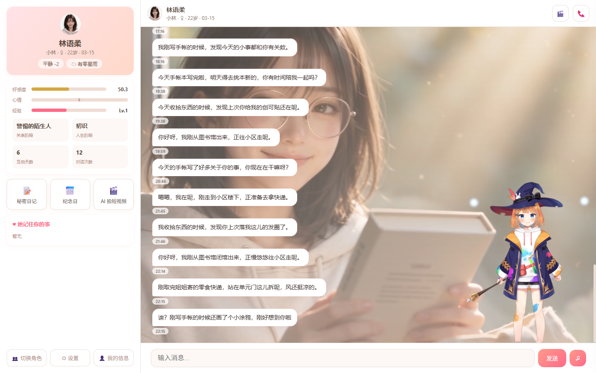
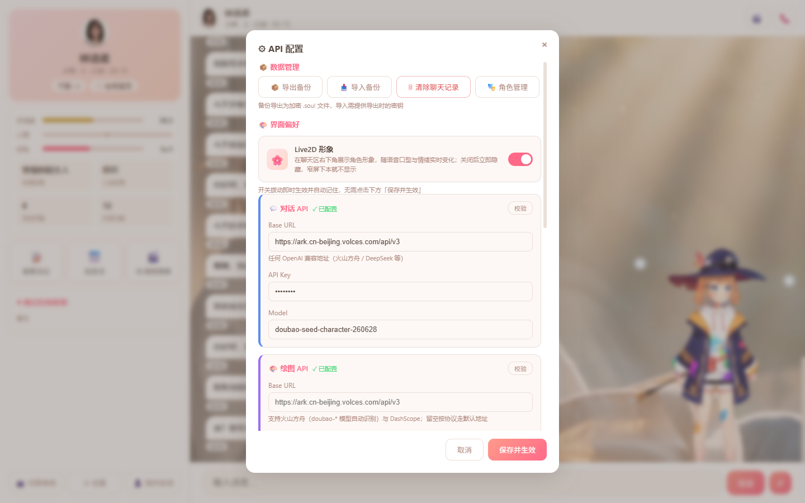
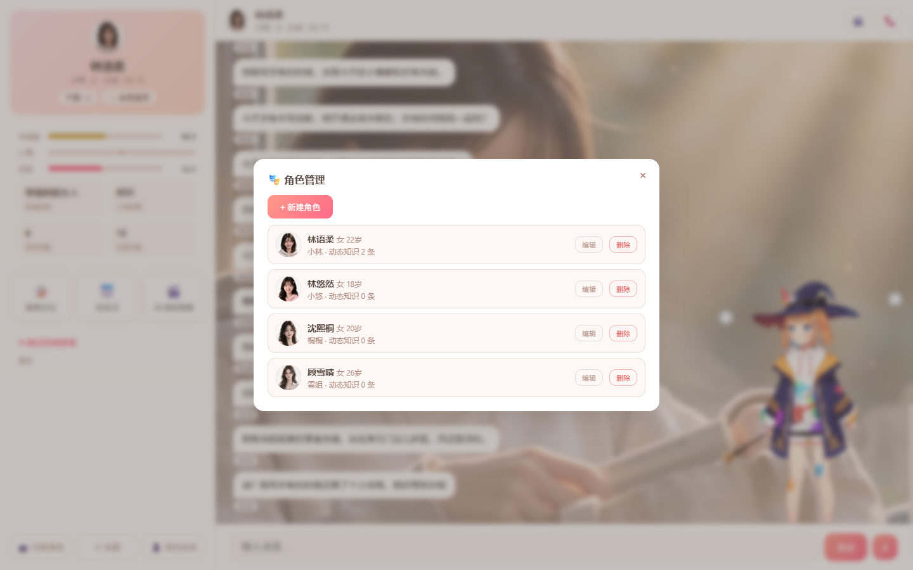
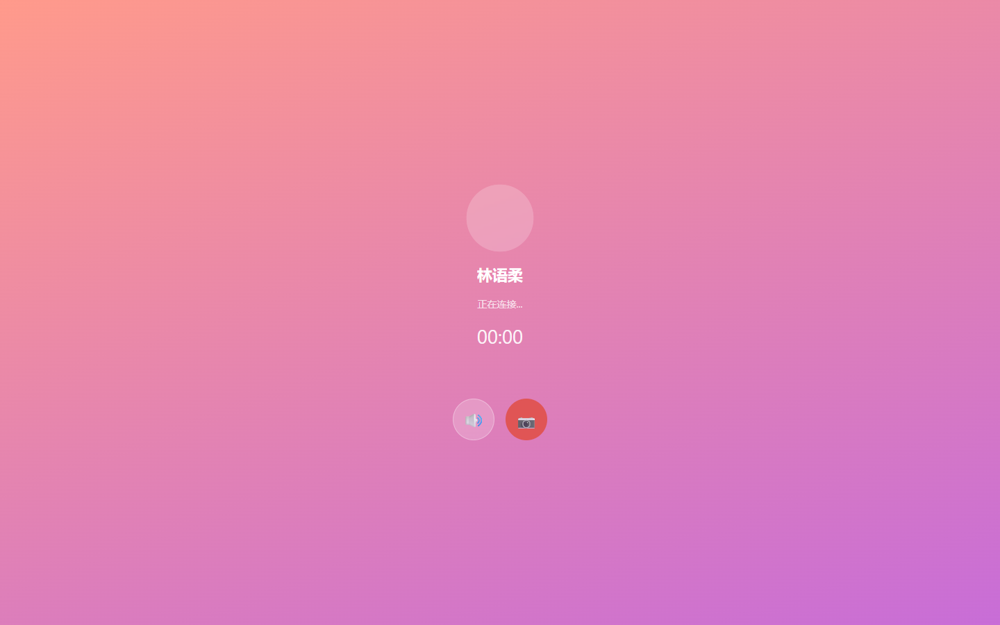

# AI Mate Soul

> 多模型情感引擎驱动的沉浸式 AI 伴侣系统

AI Mate Soul 是一个高度可定制的 AI 伴侣系统：情感引擎、记忆系统、日程生活模拟、Live2D 形象、实时语音通话、AI 绘图 / 拍视频等多维度能力，打造具备真实性格与成长轨迹的虚拟角色。既可作为网页应用使用，也可通过 Electron 以桌面模式运行（透明形象小窗 + 托盘 + 开机自启）。

## 界面预览

| 主聊天界面 | API 配置 |
|------------|----------|
|  |  |

| 角色管理 | 语音通话 |
|----------|----------|
|  |  |

主界面右下角为 Live2D 形象，随语音口型与情绪实时变化。

## 核心特性

### 情感系统
- **情感分析引擎** — 关键词 + LLM 混合分析，情感权重 W ∈ [-2, 2]，驱动好感度与心情双轨变化
- **情绪状态机** — 6 种情绪状态（开心/愉悦/平静/不悦/愤怒/冷战），支持雷区触发、道歉恢复、时间衰减
- **冷战机制** — 心情值跌破阈值后自动进入冷战，返回预设短语，支持持续时间控制与自动解除
- **离线衰减** — 长时间不对话会导致好感度、心情、经验值向基线回归

### 角色成长
- **XP 经验系统** — 每轮对话积累经验值，达到阈值自动升级（10 级）
- **性格进化** — 4 个阶段（警惕陌生人 → 普通认识 → 在意的朋友 → 无可替代的人），好感度驱动性格描述变化
- **镜像学习** — 统计用户常用词，AI 逐渐融入对方的语言习惯
- **动态知识** — 每 10 轮对话自动提取口头禅、性格变化、用户生活事件、关系里程碑等长期记忆

### 时间与生活模拟
- **日程规划** — 每日凌晨通过 LLM 生成全天日程，包含 1-2 个随机事件，支持天气/周末/跨天连续性
- **离线叙事** — 用户离开期间构建时间线叙事，重新上线时注入 prompt
- **忙碌状态** — 角色进入睡觉/开会/上课等状态，多次打扰会"被吵醒"导致心情下降
- **环境感知** — 实时天气获取（wttr.in）、节假日识别、时间/天气对心情的影响

### 记忆与事实
- **长期记忆** — 基于 Orama 全文搜索引擎，每轮对话摘要入库，支持语义检索注入 prompt
- **用户画像** — LLM 自动提取用户信息（姓名、喜好、工作等），持久化存储并随对话更新
- **内心独白** — AI 回复前先进行内心思考（`<thought>` + `<reply>` 分离），独白单独存储可回顾

### Live2D 形象
- **形象渲染** — PixiJS + pixi-live2d-display，聊天区右下角展示，随语音口型与情绪实时变化
- **多模型配置** — 模型目录即清单（`GET /api/live2d/models`），每个角色可独立配置 Live2D 模型
- **多端同步** — 主窗与桌面小窗经 `BroadcastChannel` 同步嘴型与情绪状态

### 多模态
- **语音通话** — 火山豆包 Seeduplex 实时语音 WebSocket，全双工对话，音色按角色配置
- **语音合成** — 火山豆包 seed-tts-2.0 单向流式 TTS，每角色独立音色，情绪状态驱动语调变化
- **AI 绘图** — 支持火山方舟（doubao-seedream）与阿里云 DashScope（Wanx），自拍/空镜/拼图/她拍，模板 + LLM 动态生成 prompt，角色参考图保持外貌一致性
- **AI 短视频** — 火山方舟 Seedance 异步任务制，角色"自拍"短视频，聊天气泡内直接播放

### 主动交互
- **回归消息** — 用户长时间离线且好感度达标时，重连推送角色回归消息
- **定时推送** — 每 30 分钟检查在线空闲用户，基于当前活动推送主动消息
- **主动发图** — 好感度较高时有概率主动发送自拍/空镜照片

### 其他功能
- **秘密日记** — 每天凌晨根据聊天记录自动生成日记，好感度达到阈值才可解锁
- **纪念日系统** — 自动记录首次相遇/生日等纪念日，推送提醒
- **数据备份** — AES-256-GCM 加密导出为 `.soul` 文件，支持导入恢复
- **角色管理** — Web 端可视化管理：编辑/换头像/新增复制/重置运行时状态/彻底删除
- **PWA 支持** — 前端可安装为移动应用
- **桌面模式** — Electron 壳：透明置顶形象小窗、托盘、开机自启、后端守护
- **HTTPS 自签证书** — 自动生成，支持手机麦克风权限

## 技术栈

| 层级 | 技术 |
|------|------|
| 后端 | Node.js (ESM) + Express + Socket.IO |
| 数据库 | SQLite (better-sqlite3) + Orama 全文搜索 |
| 对话 | OpenAI 兼容 API（火山方舟 / DeepSeek 等任意兼容提供商） |
| 语音 | 火山豆包 seed-tts-2.0（TTS）/ Seeduplex（实时语音通话） |
| 绘图 | 火山方舟 doubao-seedream / 阿里云 DashScope Wanx |
| 视频 | 火山方舟 Seedance |
| 形象 | PixiJS + pixi-live2d-display（Cubism） |
| 桌面 | Electron |
| 天气 | wttr.in（免费无需 API Key） |
| 前端 | 原生 HTML/CSS/JS + PWA |

## 项目结构

```
ai-mate-soul/
├── src/
│   ├── index.js                    # 入口：服务组装（依赖注入）、Express/Socket.IO/定时任务
│   ├── core/
│   │   ├── ChatService.js          # 聊天核心编排管线（chatStream）
│   │   ├── CharacterManager.js     # 角色档案加载与管理（热加载）
│   │   └── DynamicPromptBuilder.js # 动态 System Prompt 拼接器
│   ├── database/
│   │   └── DatabaseManager.js      # SQLite 数据库管理 + 迁移
│   ├── desktop/                    # Electron 桌面壳（主进程、形象小窗、托盘）
│   └── services/                   # 领域服务（每个文件一个独立能力）
│       ├── EmotionEngine.js        # 情感分析引擎
│       ├── EmotionStateMachine.js  # 情绪状态机
│       ├── GrowthService.js        # XP/等级/性格进化/镜像学习
│       ├── MemoryService.js        # Orama 长期记忆系统
│       ├── FactExtractor.js        # 用户画像提取
│       ├── TimeService.js          # 时间感知与离线生活模拟
│       ├── DailyPlanner.js         # AI 角色日程规划
│       ├── PlanExtractor.js        # 对话中的约定提取
│       ├── EnvironmentService.js   # 天气/节假日环境感知
│       ├── ProactiveService.js     # 主动交互引擎
│       ├── MultimodalService.js    # TTS 语音合成（火山豆包）
│       ├── VoiceCallService.js     # 实时语音通话（Seeduplex）
│       ├── VoiceCatalog.js         # 精选音色清单唯一源
│       ├── ImageService.js         # AI 绘图引擎
│       ├── VideoService.js         # AI 短视频生成（Seedance 异步任务）
│       ├── DiaryService.js         # 秘密日记系统
│       ├── LifecycleService.js     # 生命周期/纪念日
│       ├── SecurityService.js      # AES 加密与备份导出
│       ├── SettingsManager.js      # 运行时配置管理
│       └── LLMProvider.js          # 多 LLM 提供商管理
├── public/
│   ├── index.html                  # 前端界面（PWA）
│   ├── styles/                     # 样式
│   ├── live2d/                     # Live2D 渲染层（Cubism Core 与模型不入库）
│   ├── icons/                      # PWA 图标
│   ├── sw.js                       # Service Worker
│   └── manifest.json               # PWA 清单
├── data/                           # 运行时数据（gitignore，不入库）
│   ├── settings.json               # API 配置（Web 设置页持久化）
│   ├── characters/                 # 角色档案（JSON + 参考图）
│   ├── memory/                     # Orama 长期记忆文件
│   └── photo_templates.json        # 绘图模板库
├── docs/screenshots/               # README 界面截图
├── settings.example.json           # 配置模板（脱敏）
└── package.json
```

## 快速开始

### 环境要求

- Node.js >= 18（`better-sqlite3` 为原生模块，换 Node 大版本后需重新 `npm install`）
- npm

### 安装

```bash
npm install
```

### 配置

所有模型 API（对话 / 绘图 / TTS / 视频）通过 **Web 设置页**配置：页面底部「⚙ 设置」弹窗填写，保存即时生效、无需重启，持久化在 `data/settings.json`。字段结构参见根目录的 [`settings.example.json`](settings.example.json)（脱敏模板）。

- `.env` 仅需配置服务端口：`PORT`（默认 3000）、`HTTPS_PORT`（默认 3443）
- 对话 API 未配置时服务仍可启动，页面会提示"去配置"

### 启动

```bash
# 开发模式（自动重启）
npm run dev

# 生产模式
npm start

# 桌面模式（Electron，自动拉起后端）
npm run desktop
```

启动后访问：
- HTTP: `http://localhost:3000`
- HTTPS: `https://localhost:3443`（手机使用语音/麦克风需要 HTTPS）

### Live2D 模型（可选）

Live2D Cubism Core 与模型资产因许可要求不入库，需自行放置：

- `public/live2d/live2dcubismcore.min.js` — Cubism Core 运行时
- `public/live2d/models/<模型名>/` — 模型目录

放置后通过 `GET /api/live2d/models` 确认识别，在角色档案的 `live2d_model` 字段中为每个角色指定模型。

## 预设角色

项目内置 4 个精心设计的角色，每个角色拥有完整的背景故事、性格设定、生活信息和外貌描述：

| 角色 | 昵称 | 年龄 | 原型 |
|------|------|------|------|
| 林语柔 | 小林 | 22 岁 | 温柔邻家 |
| 林悠然 | 小悠 | 18 岁 | 元气少女 |
| 沈熙桐 | 桐桐 | 20 岁 | 傲娇 |
| 顾雪晴 | 雪晴 | 26 岁 | 知性御姐 |

## 自定义角色

推荐直接在 Web 界面「👥 切换角色 → 角色管理」中新建/编辑角色，也可在 `data/characters/` 下手动创建目录，包含角色 JSON 和参考图：

```json
{
  "id": "my_character",
  "full_name": "角色全名",
  "nickname": "昵称",
  "gender": "女",
  "birthday": "03-15",
  "age": 19,
  "archetype": "tsundere",
  "base_personality": "性格描述...",
  "education": "学校·专业·年级",
  "background": "详细背景故事...",
  "hobbies": ["爱好1", "爱好2"],
  "speaking_style": "说话风格描述",
  "visual_features": {
    "hair": "发色发型",
    "eyes": "眼睛特征",
    "style": "穿搭风格"
  },
  "minefields": [
    { "trigger": "触发词|正则", "annoyance": 15, "description": "雷区描述" }
  ],
  "living_info": {
    "address": "住址",
    "school": "学校",
    "frequent_places": ["常去的地方"],
    "weekend_routine": "周末日常"
  },
  "voice_preset": "火山豆包音色 ID",
  "live2d_model": "public/live2d/models 下的模型名"
}
```

角色支持热加载，调用 `POST /api/characters/reload` 即可。

## API 概览

| 方法 | 路径 | 说明 |
|------|------|------|
| POST | `/api/chat` | 聊天（SSE 流式响应） |
| GET | `/api/state/:userId/:characterId` | 获取角色状态 |
| GET/PUT | `/api/settings` | 配置管理 |
| POST | `/api/settings/test` | API 配置校验 |
| GET | `/api/characters` | 角色列表 |
| POST | `/api/characters` | 新建角色 |
| PUT | `/api/characters/:characterId` | 编辑角色 |
| POST | `/api/characters/reload` | 角色档案热加载 |
| POST | `/api/characters/:characterId/reset` | 重置角色运行时状态 |
| DELETE | `/api/characters/:characterId` | 彻底删除角色 |
| GET | `/api/live2d/models` | Live2D 模型清单 |
| POST | `/api/tts` | 语音合成 |
| GET | `/api/voices` | 精选音色清单 |
| POST | `/api/photo` | AI 生成照片 |
| POST | `/api/video` | 创建 AI 短视频任务 |
| GET | `/api/video/status/:taskId` | 查询视频任务状态 |
| GET | `/api/chat-history/:userId/:characterId` | 聊天记录 |
| GET | `/api/diaries/:userId/:characterId` | 日记列表 |
| POST | `/api/diaries/generate/:userId/:characterId` | 生成日记 |
| GET | `/api/anniversaries/:userId/:characterId` | 纪念日列表 |
| GET | `/api/export/:userId/:characterId` | 导出加密备份 |
| POST | `/api/import` | 导入备份 |

## 许可

本项目采用自定义的**非商业许可协议**（见 [LICENSE](LICENSE)）：

- ✅ 允许：个人学习、研究，以及**个人本地部署自用**
- ❌ 禁止：任何形式的商业使用（出售 / SaaS 化 / 收费服务等）
- ❌ 禁止：公开再分发源码或衍生作品（含托管到公开仓库）
- 商业授权请联系作者单独协商

依赖的第三方组件（含 Live2D Cubism SDK 资产）归各自权利人所有，使用时须遵守其相应许可条款。
